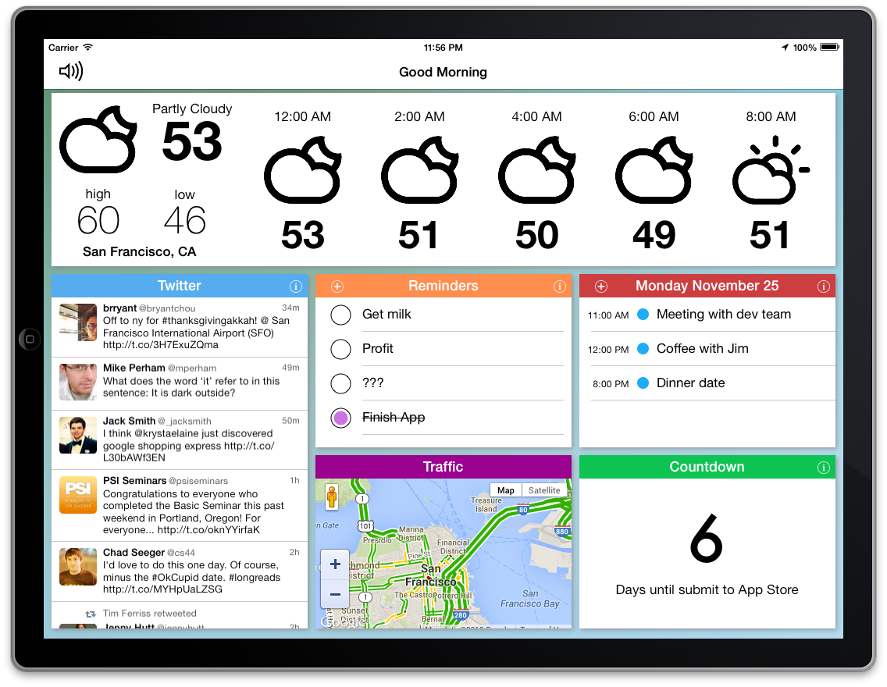

# GoodMorning

GoodMorning is a fun dashboard app built to make your day easier. Think of it like a day-at-a-glance. Pick up your iPad first thing in the morning and know if you will have an awesome or craptastic day immediately. With GoodMorning you can:

  * See hourly weather forecast in your area
  * View events that you have scheduled for the day
  * View reminders that you have created
  * Set and view a countdown timer
  * View traffic in your neighborhood
  * View any twitter feed that you have linked to your iPad
  * Listen to a text-to-speech version of your day

Built GoodMorning as a part of the [iOS CodePath Bootcamp](http://thecodepath.com/iosbootcamp). Released on the [iTunes App Store](https://itunes.apple.com/us/app/plants-vs.-zombies/id350642635).

## Interesting features

### Container view controllers
Each module represents its own controller with full lifecycle methods. The main controller manages each one a separate container.

### Drag'n'drop
If you press and hold a module, you can drag it to a new location. This is achieved by pulling the view out of the layout and moving around a slightly bigger facsimile with a red border to the current touch position. The layout restricts modules into a 3x3 grid. Each element is 328 points wide by 222 points tall. 

## License

* [MIT](http://opensource.org/licenses/MIT)
Copyright (c) 2013 Benjamin Henry, Felix Santiago, Benjamin Lindsey

## Building

This projects uses CocoaPods 0.26.2 for its dependency management. For more information, go to: [http://cocoapods.org/](http://cocoapods.org/).
After satisfying those requirements, the build is pretty simple:

* Run `pod install` from the root directory to install necessary pods
* Open GoodMorning.xcworkspace in XCode 5 and run it

## Acknowledgements

This project uses [forecast.io](https://developer.forecast.io/) API for weather forecasts.

It also uses other open source libraries such as:

 * [AFNetworking](https://github.com/AFNetworking/AFNetworking)
 * [RFQuiltLayout](https://github.com/bryceredd/RFQuiltLayout)
 * [DraggableCollectionView](https://github.com/lukescott/DraggableCollectionView)

## Contributing

Please fork this repository and contribute back using
[pull requests](https://github.com/felixsan/GoodMorning/pulls).

Any contributions, large or small, major features, bug fixes, additional
language translations, unit/integration tests are welcomed.
